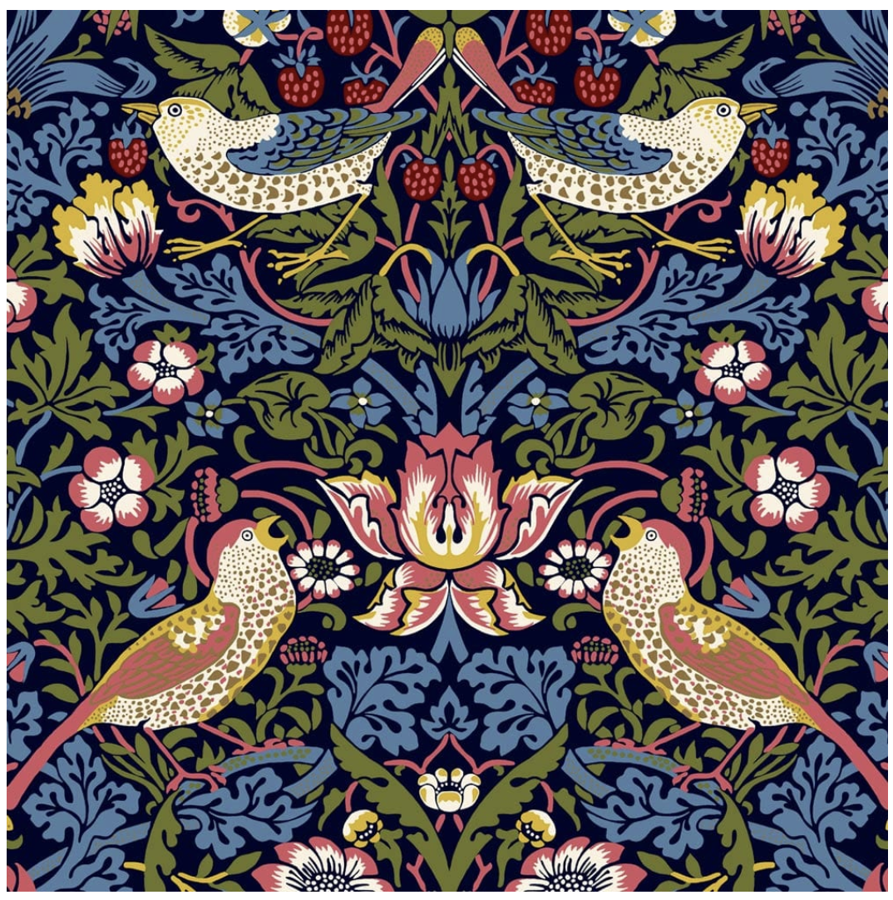
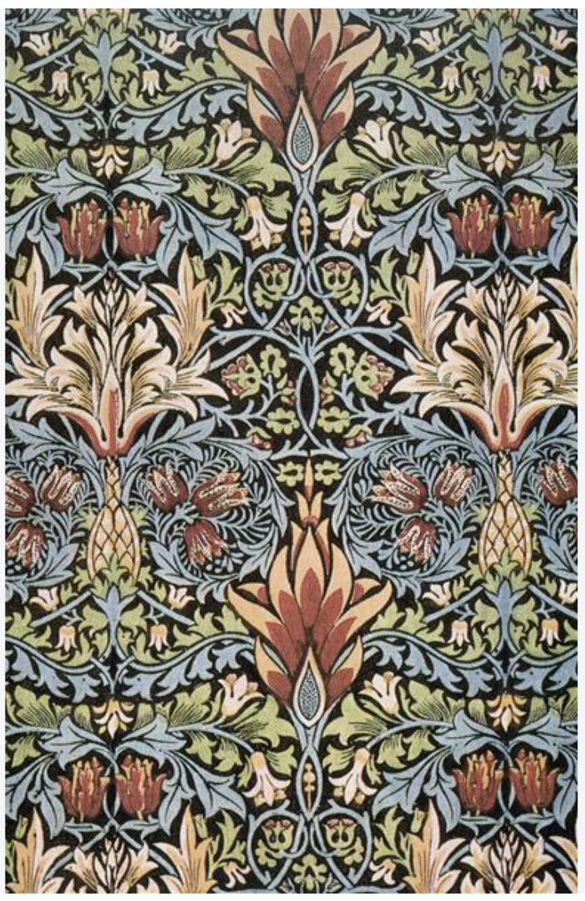
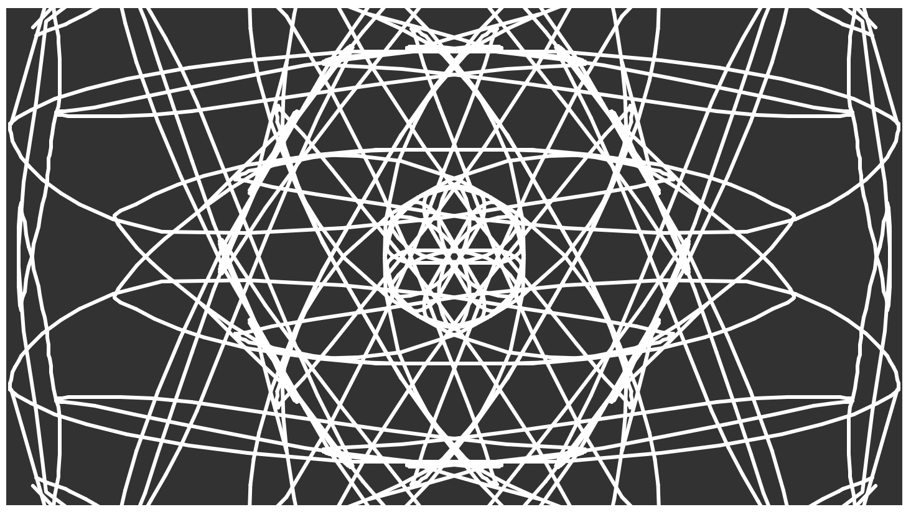

# xwan0195_9103_tut3_quiz8
## Quiz 8 assignment
- **Imaging Technique Inspiration**
  - I really like the nature-based, symmetrical patterns in William Morris’s textile designs. His use of repeating flowers, birds, and mirrored layouts feels both structured and natural. I want to bring this kind of detailed, balanced look into my own interactive work. It gives a calm and organized feeling, and I think it’s a great way to make the visual experience more interesting and meaningful for users.
  
  
  

- **Coding Technique Exploration**
    - To create this kind of symmetrical effect, I found a great example using p5.js called “Kaleidoscope.” It uses polar coordinates and rotation to copy shapes around in a circle. This makes a pattern that repeats like a real kaleidoscope. It’s perfect for getting that William Morris style and turning it into something users can play with.
    - [Technique Link](https://p5js.org/examples/repetition-kaleidoscope/)
    